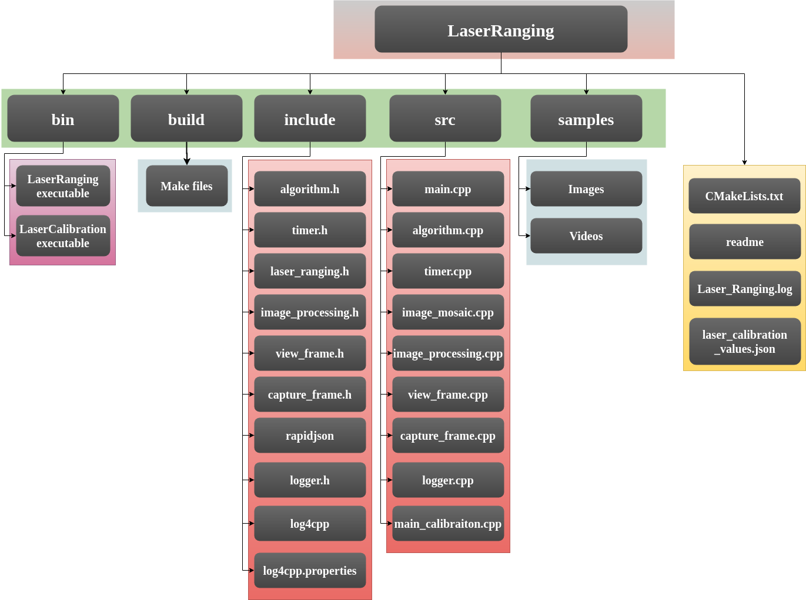
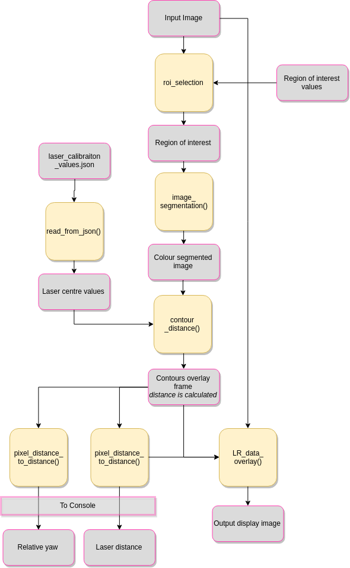
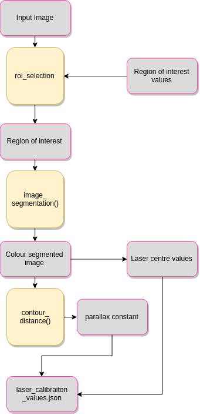

# LASER RANGING
---------------------                                
<div style="text-align: right"> Planys Technologies </div>

### Image Processing based Laser Ranging is a Technology which measures distance to an object by projecting (two preferrably) laser dots on the object and capturing its image using a camera.


## SETIING UP
Make sure you have the following files in your system
1. main.cpp
2. main_calibration.cpp
3. laser_ranging.cpp
4. laser_ranging.h
5. laser_calibration.cpp
6. laser_calibration.h
7. image_processing.cpp
8. image_processing.h
9. view_frame.cpp
10. view_frame.h
11. capture_frame.cpp
12. capture_frame.h
13. timer.cpp
14. timer.h
15. algorithm.cpp
16. algorithm.h
17. logger.cpp
18. logger.h
19. laser\_calibration_values.json
20. log4cpp.properties
21. Laser_Ranging.log (will be automatically created if not)
22. CMakeLists.txt

Dependencies

1. Opencv 3.4
2. rapidjson

### File System
-------------



Now to compile, move to the main directory and run the following commands on terminal.

```
cd build
cmake ..
make
```
### Configuration File

#### Program Execution
1. DebugMode : 

    "true" : Log file will be written to disk, Debug logs will be recorded.

    "false" : Log file will not be written. All logs above Debug flag will be shown in console.

2. RunnningMode : 

    "commandline" : run with arguments list in terminal.

    "GUI" : Run with information flow from GUI layer.

    "automated" : Run with Directory for enhancing every file in it.

3. ExeMode : 

    "DEV" : Developer mode. This will display every windows during execution.

    "EXE" Execution mode. This will suppress every windows displays. Output files will be written

#### General Settings
1. DefaultInput : 

    "PathToFile" : This file will be used when no file are supplied by the user.


3. RegionOfInterest_x

    integer(0,100) : Distance to the left side of Region of interest in percentage of width.

4. RegionOfInterest_y

    integer(0,100) :  Distance to the top side of Region of interest in percentage of height.

5. RegionOfInterest_width

    integer(0,100) :  Width of Region of interest in percentage of width.

6. RegionOfInterest_height

    integer(0,100) : Height of Region of interest in percentage of height.


#### Laser Ranging Settings

1. SingleLaser : 

    true : Laser Ranging with single laser mode 
    false : Conventional Laser Ranging mode with two lasers. 

2. UseWhite : 

    true : White color also get filtered along with set color. (for filtering the white dot inside lasers)

    false : White color will not be filtered in . 

3. UseDehaze : 

    true : frames will be dehazed using CLAHE before Laser Ranging.
    false : No dehazing will be applied.
    
4. DynamicControl : 

    true : Control panel with dynamic control parameters will be available
    false : Dynamic control is unavailable

5. Hue,Saturation,Value Limits :

    integer(0,255) : Setting these values appropriately will let the user filter the desired color in. Changed when changing the laser color. Automatically set to values corresponding to Red.

#### Laser Calibration Settings

1. CalibrationDistance :

    int(>0) : The chosen distance for calibration. Used to calculate parallax constant during calibration.
 


### Commandline execution


The code offers multiple modes of execution

1. devoloper mode:

    This is the complete model. every outout will be shown and all the functionalities will be avalilable.
    disabling this mode will disable every displays functions.

2. execution mode:

        This mode is the minimal version and right now only working with image an image stream directly obtained from vision.


To run the Laser Ranging code, first move to bin directory by

```
cd bin
```

1. Laser Ranging with Video file.
```
./LaserRanging <path to video>
```

2. Laser Ranging with Image file.
```
./LaserRanging <path to image>
```

3. Laser Ranging with camera input
```
./LaserRanging <camera device number>
```

4. Laser Ranging without arguments
```
./LaserRanging
```
The code loads a default video file "rendered.mp4"


1. Laser Calibration with Video file.
```
./LaserCalibration <path to video>
```

2. Laser Calibration with Image file.
```
./LaserCalibration <path to image>
```

3. Laser Calibration with camera input
```
./LaserCalibration <camera device number>
```

4. Laser Calibration without arguments
```
./LaserCalibration
```
The code loads a default file 


## PUBLICALLY ACCESSIBLE PARAMETERS

*(for the following section, Ranger is used as an object to the class LaserRanging and calibrate is used as an object to the class LaserCalibration)

### Public Variables that can be set manually for Laser Ranging

1. Ranger.laser\_range\_status

   ` true` : Laser ranging will be activaed

   `false` : Laser ranging will be de-activated and direct feed from camera/video will be given back

2. Ranger.use\_dynamic\_control

    `true` : Control Panel GUI will be available for dynamic parameter changeing.

    `false` : Control Panel become unavailable.


3. Ranger.use_white

    `true` : Filters white colors also for color segmentation (useful when laser dots become white instead of a color)

    `false` : Only filters set color.

4. Ranger.use_dehaze

    `true` : The frames(Region of interset only) will be dehazed using basic dehazing algorithms before processing. Gives better results but computationally expensive.

    `false` : Process images without dehazing


5. Ranger.distance\_between_laser

    ```int```: Stores Actual distance between laser pointers


6. Ranger.laser_center\_x
    
    ```int```: Manually sets x coordinate of laser point's center. 

7. Ranger.laser_center\_y

    ```int```: Manually sets y coordinate of laser point's center. 

### Public functions that can be used set parameters for Laser Ranging

1. Ranger.set_roi()

    Set region of interst passing x and y coordinate of center point and width and height of the needed region of interst

    ```c++
    Ranger.set_roi(int x, int y, int width, int height);
    ```

2. Ranger.set_threshold()

    Set threshold values for color based image segmentation passing hue,saturation and value limits
     ```c++
    Ranger.set_threshold(int hue_lower_limit, int hue_upper_limit, int saturation_lower_limit, int saturation_upper_limit, int value_lower_limit, int value_upper_limit);
    ```


### Public Variables that can be set manually for Laser Calibration


2. calibrate.use\_dynamic\_control

    `true` : Control Panel GUI will be available for dynamic parameter changeing.

    `false` : Control Panel become unavailable.


3. calibrate.use_white

    `true` : Filters white colors also for color segmentation (useful when laser dots become white instead of a color)

    `false` : Only filters set color.

4. calibrate.use_dehaze

    `true` : The frames(Region of interset only) will be dehazed using basic dehazing algorithms before processing. Gives better results but computationally expensive.

    `false` : Process images without dehazing

5. calibrate.calibration_status

    `true` : Calibration for laser get executed and the main program resumes after calibration.

    `false` : Skips calibration.

6. calibrate.calib_trigger

    `true` : Trigger for capturing laser center values from Calibraiton process. Gets set back to false automatically.

    `false` : Calibration continues 

7. calibrate.calib_cancel

    `true` : Cancels Calibration and resumes the main program.

    `false` : Calibration continues

9. calibrate.laser_center\_x
    
    ```int```: Manually sets x coordinate of laser point's center. 

10. calibrate.laser_center\_y

    ```int```: Manually sets y coordinate of laser point's center. 


### Public functions that can be used set parameters for Laser Calibration

1. calibrate.set_roi()

    Set region of interst passing x and y coordinate of center point and width and height of the needed region of interst

    ```c++
    calibrate.set_roi(int x, int y, int width, int height);
    ```

2. calibrate.set_threshold()

    Set threshold values for color based image segmentation passing hue,saturation and value limits
     ```c++
    calibrate.set_threshold(int hue_lower_limit, int hue_upper_limit, int saturation_lower_limit, int saturation_upper_limit, int value_lower_limit, int value_upper_limit);
    ```

3. calibrate.algo.set\_CLAHE\_clip\_limit()

    Set clip limit(parameter for CLAHE based dehazing) 
    ```c++
    calibrate.algo.set_CLAHE_clip_limit(int clip_limit)
    ```

### Publically accessible variables for Laser Ranging

1. Ranger.range_mm

    ```float  ```:  Returns range in millimeter

2. Ranger.range_ll\_mm

    ```float  ```: Returns range according to left in millimeter

3. Ranger.range_rl\_mm

    ```float  ``` : Returns range according to right in millimeter

4. Ranger.original_frame

    ```CaptureFrame``` : Returns CaptureFrame object containing the frame which got passed into the function

5. Ranger.ROI_frame

     ```CaptureFrame```: Returns CaptureFrame object containing the region of interest.

6. Ranger.dehzed_frame

     ```CaptureFrame``` : Returns CaptureFrame object containing the dehazed image.

7. Ranger.segmented_frame

     ```CaptureFrame``` : Returns CaptureFrame object containing the frame which got passed into the function

8. Ranger.contour_overlay\_frame

    ```CaptureFrame``` : Returns CaptureFrame object containing the contour identified. This will be a single channel image.

9. Ranger.line_overlay\_frame

    ```CaptureFrame``` : Returns CaptureFrame object containing the line drawn connecting laser points. This will be a single channel image.

### Publically accessible functions to get data for Laser Ranging

1. Ranger.get_laser\_disatance\_px()

    To retrieve the distance in pixels between two laser points.
    ```c++
    float distance = Ranger.get_laser_disatance_px()
    ```

2. Ranger.get_left\_laser\_disatance\_px()

    To retrieve the distance in pixels from left laser point to laser center. Used in single laser ranging enebled mode.
    ```c++
    float distance = Ranger.get_left_laser_disatance_px()
    ```

3. Ranger.get_right\_laser\_disatance\_px()

    To retrieve the distance in pixels from right laser point to laser center. Used in single laser ranging enebled mode.
    ```c++
    float distance = Ranger.get_right_laser_disatance_px()
    ```

4. Ranger.scale\_L\_by\_px()

    To retrieve the ratio of distance between lasers to the pixel distance between the laser points. This value is used for UI scale of referance.
    ```c++
    float scale = Ranger.scale_L_by_px()
    ```

5. Ranger.angle_of\_tilt()

    To retrieve the angle of tilt of the surface to which the lasers are pointed. The angle will be in degrees.
    ```c++
    float angle = Ranger.angle_of_tilt()
    ```

## Program Flow

### Laser Ranging




### Laser Calibration



## INCLUDED FILES

   

## 1. laser_ranging.cpp   
            
 ### Class LaserRanging

 Derived class of Class ImageProcessing. Have functions and variables exclusively used for Laser Ranging.

#### Functinos

 * CaptureFrame contour_distance(CaptureFrame)              :
    
    *Identify contours and distance between them in a segmented image*              
 * CaptureFrame contour_distance_single_laser(CaptureFrame)   : 
    
    *Identify contours and distance between them in a segmented image for single laser ranging enabled*

 * float get_laser_distance ()             : 
    
    *Distance from two laser dots*
 * float get_left_laser_distance()     : 
    
    *Distance according to left laser dot*      
 * float get_right_laser_distance ()       : 
    
    *Distance according to right laser dot*  
 *   void laser_ranging (CaptureFrame)                  : 
    
      *Single function to call all associated functions for laser ranging*   
 * void laser_ranging_single_laser (CaptureFrame)     : 
    
    *Single function to call all associated functions for laser ranging with single laser ranging enabled*
 * CaptureFrame LR_data_overlay(CaptureFrame)                   : 
    
    *Show overlays associated with laser ranging*   
 * CaptureFrame LR_data_overlay_single_laser(CaptureFrame)       : 
    
    *Show overlays associated with laser ranging with single laser ranging enabled* 

* CaptureFrame laser_ranging_calibration(CaptureFrame)       : 
    
    *Runs calibration, determine and write the laser center values to a file (only for single laser)* 
* CaptureFrame image_stream_laser_ranging(cv::Mat)       : 
    
    *Execute laser ranging when input is image stream* 
* CaptureFrame image_stream_laser_ranging_single_laser(cv::Mat)       : 
    
    *Execute laser ranging in single laser mode when input is an image stream* 

* CaptureFrame image_stream_laser_ranging_calibration(CaptureFrame)       : 
    
    *Run calibration and write the laser center values to a local file when input is an image stream* 


 ***Public Variables***
 * laser_center_x                  : 
        
    *to change the center point between two lasers (single laser only)*
 * laser_center_y                  : 
        
    *to change the center point between two lasers*
 * range_mm                          : 
        
    *to extract range data*
 * range_lr_mm and range_ll_mm      : 
        
    *to extract left range data and right range data (single laser only)*
 * segmented_frame                    : 
        
    *to extrace segemented image*
  * ROI                             : 
        
      *to extract region of interest*
 * extract dehazed image
 * contour_overlay                 : 
        
    *to extract contour identified*
 *  line_overlay                    : 
        
      *to extract line drawn between the contors*

*  original                        : 
        
     *to extract the original image that is passed to laser ranging* 
* calibration_status

     *to decide whether to do calibration or not*

* use_dehaze

     *to decide whether to filter white color also along with colour*

* use_dynamic_control

     *for displaying the control panel for real-time control*

* laser_ranging_status

     *to decide whether to run the laser ranging or not*

* dev_mode

     *to toggle developer mode. `false` means no preview will be available*

* distance_between_lasers

     *to set the actual distance between two laser pointers in mm*

* calibration_distance

     *the distance to the normal plate from camera in calibration.*

* parallax_constant

     *the proportionality constant for prallax method. This is found out using calibration and is written to a local file*


## 2. **laser_calibration.cpp**    

### Class LaserCalibration

Timer class is used for measuring the execution time and maximum fps. It calculates the time between timer initialising and timer ending.


 ***Functions***

 * void laser_ranging_calibration(CaptureFrame)                   : 
        
     *starts laser ranging calibration and stores values to local json file*
 *  void image_stream_laser_ranging_calibration              (CaptureFrame)       : 
        
     *Laser calibration for image stream*
 * void image_stream_laser_ranging_calibration(CaptureFrame, mode)                       :    
       
     *Laser ranging for image stream in given mode*
 * void image_frame_laser_ranging_calibration (cv::Mat,mode)                    : 
    
     *Image stream laser calibration in given mode when a mat object is given*
 * void write_to_json(message ,mode)
        :   

    *write calibration data into the local json file*

 ***Public Variables***

 *    calib_trigger                 : 
    
         *to trigger data capture in laser calibration*

 * calib_cancel  :

     *to exit calibration without changin the values*

*    calibration_status                 : 
    
         *variable to disable or enable laser_ranging*

 * calibration_distance  :

     *the distace used in calibration. This will be used for finding prallax constant*


## 3. image_processing.cpp

### Class ImageProcessing

Class Imageprocessing will have the basic image processing functionalities. This class will be the parent class class for most of the other image processing classes.


**Functions**

  *  CaptureFrame roi_selection(CaptureFrame)                 :
     
     *Crop the region of interset*
  * CaptureFrame hsv_segmentation  (CaptureFrame)              : 
        
     *Segment image according to color set previously (preset for red)*
 *  void set_threshold (CaptureFrame)                : 
        
    *set color threshold according to scene or manual input*
 * void set_roi  (int x_percent,int y_percent,int width,int height)                       : 
        
   *Set region of interset*

  ***Public Variables***

 * threshold_high_0                : 
        
    *to set high value of color threshold in 0 hue range*
 * threshold_high_180              : 
        
    *to set high value of color threshold in 180 hue range*
  * threshold_low_0                 : 
        
     *to set low value of color threshold in 0 hue range*
 * threshold_low_180               : 
        
    *to set low value of color threshold in 180 hue range*
 * roi_percentage                  : 
       
    *to set required region of interest percentage*

## 4. algorithm.cpp

### Class Algorithm

Algorithm class will contain all the algorithms needed for image processing. one object of this class will be present in ImageProcessing class.

***Functions***
    
* CaptureFrame CLAHE_dehaze(CaptureFrame)                     : 
        
     *Dehaze using CLAHE algorithm*
 * CaptureFrame hist_equalize (CaptureFrame):                     : 
       
    *Dehaze using normal histogram equalization.*

## 5. view_frame.cpp

### Class ViewFrame

ViewFrame class is used for displaying the images. This class offers multiple modes of displaying including multiple displays(upto 4 frames) and interrupted displays(waits for user input and then continue)

***Functions***

 * void single_view_interrupted   (CaptureFrame)      : 
        
     *Show single window and wait for user input to continue*
 *  void single_view_uninterrupted (CaptureFrame)      : 
        
     *Show single window and continue*
 * void multiple_view_interrupted  (CaptureFrame,CaptureFrame,CaptureFrame,CaptureFrame)     : 
        
     *Show multiple windows and wait for user input to continue*
 * void multiple_view_uninterrupted (CaptureFrame,CaptureFrame,CaptureFrame,CaptureFrame)    : 
        
    *Show multiple windows and continue*
 * CaptureFrame add_overlay_percent (CaptureFrame input, x_percent,y_percent,data)            : 
        
   *Add overlays to the image at a point according to percentage*
 * CaptureFrame add_overlay (CaptureFrame,x_point , y_point, data)                    : 
        
    *Add overlays to the image at the specified point*

 * CaptureFrame join_image_horizontal (CaptureFrame image1,CaptureFrame image2)                    : 
        
    *Takes two images and join them horizontlly to one single bigger image. Used in every multiple output functions*

 * CaptureFrame add_overlay (CaptureFrame image1,CaptureFrame image2)                  : 
        
    *Takes two images and join them vertically to one single bigger image. Used in every multiple output functions*
        
## 6. capture_frame.cpp

### Class CaptureFrame

CaptureFrame class is used as a substitute for image and video files. It holds one image and one video file and associated functions to load,manipulate,retrieve them.

 **Functions**

  * void capture_image (filename,window_name)                  : 
        
    *load image*
 * void capture_video     (filename,window_name)               : 
    
    *load video*

 * void reload_image        (image,window_name)             : 
    
    *rewrite existing image*

 * void reload_video       (video,window_name)             : 
    
    *rewrite existing video*

 * CaptureFrame retrieve_image                  : 
    
    *extract stored image*
 *  CaptureFrame retrieve_video                  : 
    
     *extract stored video*
 * void frame_extraction                : 
    
   *extract frame from video and store it in  image*
    . clear                           : 
    
    *clear all the data in the object
        
## 7. **timer.cpp**    

### Class Timer

Timer class is used for measuring the execution time and maximum fps. It calculates the time between timer initialising and timer ending.


 ***Functions***

 * timer_init ()                     : 
        
     *start the timer*
 * timer_end                ()       : 
        
     *end the timer and calculate execution time and maximum fps*
 * CaptureFrame add_time ()                       :    
       
     *add execution timer as overlay to image*
 * CaptureFrame add_fps   ()                      : 
    
     *add maximum fps as overlay to image*

 ***Public Variables***

 *    execution_time                  : 
    
         *to extract the execution time data*

 * fps  :

     *to extract the maximum fps data*
        

## 7. **logger.cpp**    

### Class Logger

Logger class is used for logging the state of the program during execution. A local log file named "Laser_Ranging.log" will be updated during the execution with time stamp and messages. Only logs which have equal and higher priority than WARN will shown in console. Every logs(all priorities) are written in log file.


 ***Functions***

 * void log_error (message)                     : 
        
     *record a log in error priority.*

 * void log_warn (message)      : 
        
     *record a log in warning priority.*

 * void log_info (message)                         :    
       
     *record a log in info priority.*

 * void log_debug (message)                        : 
    
     *record a log in debug priority.*

 * void logger_initialize()                        : 
    
     *initialize logger and link it to the local file. A file called log4cpp.properties are used for this purpose. it also determins the layout of recording log*


## Program Execution Time

Program's execution times are very important in terms of scalability and reliability. The program is tested with 2 computers with the following configuration

### System - 1
     CPU   - Intel i5 5th Generation quad core
     RAM  - 4 GB
    Ubuntu 14.04


| Tasks                 |   Time Taken  (ms)                    |
| -------               | ----------                            |
| ROI selection         |       1.56                           |
| Dehazing (optional)   |   21.76 (CLAHE) \| 11.75(Eq Histogram) |
| Image segmentation    |   11.25                                 |
| Contour Identification|   2.24                                |
| Data Overlay          |   1.03                                |
| Display               |   37.9                               |

#### --With Dehaze (CLAHE)--

_total time in developer mode_ -- 78.9 ms

_total time in execution mode_ -- 40.33 ms   (without display)

#### --Without Dehaze--

_total time in developer mode_ -- 56.78 ms

_total time in execution mode_ -- 18.67 ms   (without display)


### System - 2
     CPU   - Intel i7 5th Generation octa core
     RAM  - 8 GB
    Ubuntu 16.04

| Tasks                 |   Time Taken  (ms)                    |
| -------               | ----------                            |
| ROI selection         |   0.55                                |
| Dehazing (optional)   |   14.7 (CLAHE) \| 11.8(Eq Histogram) |
| Image segmentation    |   7.72                                 |
| Contour Identification|   1.32                               |
| Data Overlay          |   0.52                                |
| Display               |   21.31                               |

#### --With Dehaze (CLAHE)--

_total time in developer mode_ -- 46.73 ms

_total time in execution mode_ -- 24.91 ms   (without display)

#### --Without Dehaze--

_total time in developer mode_ -- 32.66 ms

_total time in execution mode_ -- 11.55 ms   (without display)
